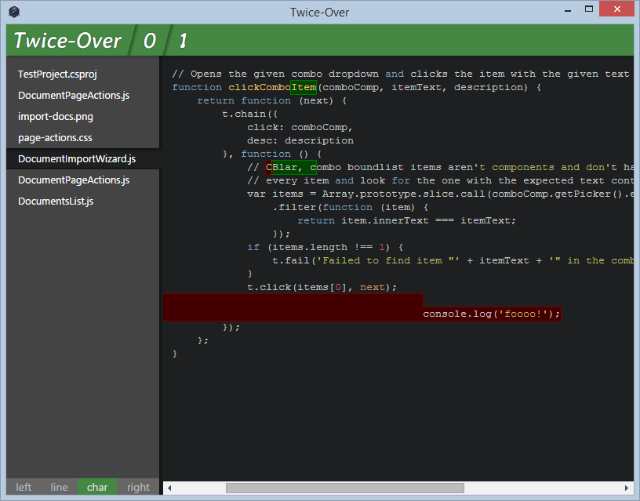
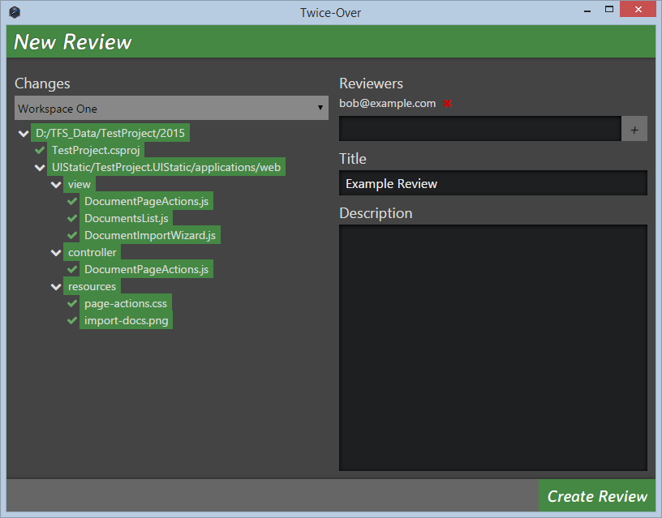

# Twice-Over
An iterative code review tool supporting cross-iteration diffing and change commenting with syntax highlighting. Built to support Windows environments using TFS and Visual Studio.

## Why another code review tool?
Corporate development shops not willing or able to use version control systems like git or mercurial are stuck in the dark ages when it comes to code reviews. Twice-Over aims to fix this.

## Background
For those who have developed code at Microsoft in recent years and experienced the wonder that is their internal tool CodeFlow, Twice-Over's design will seem familiar. For all others, come and experience the joy of iterative code review!

## In-Progress Screenshots

## Status

Twice-Over is in alpha currently. Here is the current development outline for the project:
### twiceover-client
nw.js-based thick client to support code review creation from changes on the local system.

**Done:**
- TFS integration via subprocess calls to tf.exe, requires Visual Studio 2010+ on the system
- email alias autocomplete via Active Directory queries through subprocess calls to  [EmailChecker](https://github.com/Coldarn/twiceover-emailchecker)
- code file differencing via [jsdiff](https://github.com/kpdecker/jsdiff)
- code syntax highlighting via [Highlight.js](https://github.com/isagalaev/highlight.js)
- adding new iterations and diffing between any pair of them
- inline commenting

**To Do:**
- server communication for persisting and loading reviews
- review-level comments
- adding/removing reviewers after creation

### [twiceover-server](https://github.com/Coldarn/twiceover-server)
node.js-based web server to support persisting and hosting reviews along with sending out emails.

**To Do:**
- review creation/persistence
- adding comments and iterations to an existing review
- browsing outstanding reviews
- sending emails for review invites and updates
